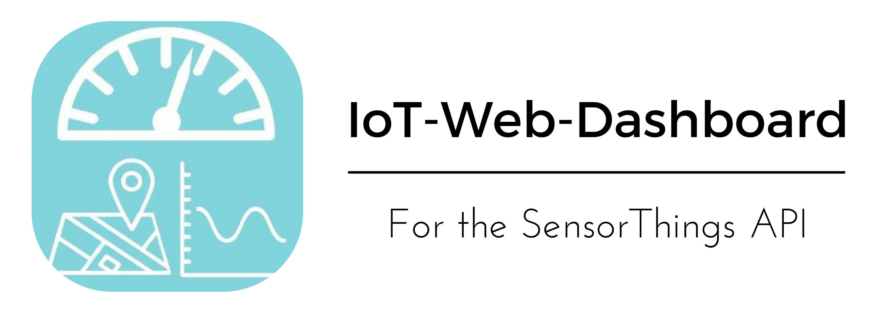
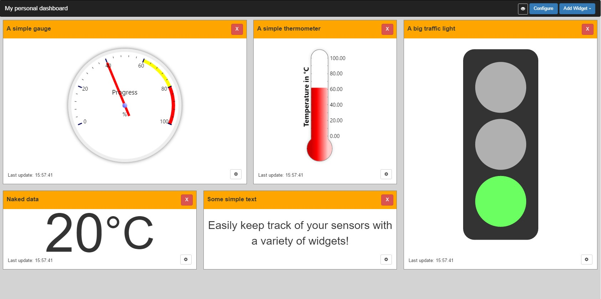
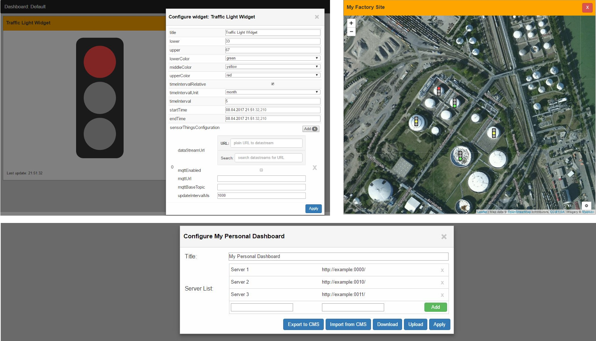

# Introduction

This dashboard provides easy-to-use client-side visualisation of Internet-of-Things sensor data from [OGC SensorThings API](https://github.com/opengeospatial/sensorthings) compatible servers. Various types of widgets can be arranged and configured on the dashboard. It is a web application and can be embedded into any website. 

**Authors:** Simon Böhm, Moritz Grauer, Daniel Liebler, Robin Maisch, Till Stöckmann, Frederic Tausch

# Screenshots




# How to use

A demo of an integration of this dashboard can be found in the [public](https://github.com/IoT-WebDashboard/IoT-WebDashboard) folder. The RGraph libraries will still be needed for it to work!

You need the following files:
 - [*iotwebdashboard.js*](https://github.com/IoT-WebDashboard/IoT-WebDashboard) | The code for the dashboard
 - [*iotwebdashboard.css*](https://github.com/IoT-WebDashboard/IoT-WebDashboard) | The style files for the dashboard
 
These two files can be found in a release version in the [public](https://github.com/IoT-WebDashboard/IoT-WebDashboard) folder. They have to be imported into the host website after importing the dependencies. 

## Needed Dependencies ##

 - jQuery & jQueryUI 
 - Bootstrap (CSS & JS)
 - [Gridstack](https://github.com/troolee/gridstack.js)
 - [lodash](https://lodash.com/) (Needed for Gridstack)
 - [RGraph](https://www.rgraph.net/) (At least common.core, gauge, scatter, line, thermometer, bar)
 - [Leaflet](http://leafletjs.com/)
 - [MQTT.js](https://www.npmjs.com/package/mqtt)
 
As you can see in the demo, there are CDNs for every dependency except RGraph. You will have to download and serve this yourself.

# Development

## Getting started ##

### Install the `gulp` command
These instructions require node.js and npm

```sh
npm install --global gulp-cli
```

### Install needed development dependencies

```sh
npm install
```

## Run the Project

To cross-compile and test your project, run
```sh
gulp test
```

To start your server, run:
```sh
gulp server
```

You can reach the server at the URL http://localhost:8080/webpack-dev-server/public/index.html
The URL has to be opened in a browser with single origin policy disabled. Otherwise, you will not be able to get data from multiple SensorThings API servers.

### Windows (Chrome)
Stop all Chrome processes. (Use the task manager. Closing all Chrome windows is not sufficient.)

Go to the directory that contains chrome.exe and run:
```sh
chrome.exe --disable-web-security --allow-file-access-from-files --user-data-dir="C:/Chrome"
```

### OSX (Chrome)
Stop all Chrome processes, then run: 

```sh
open -a "Google Chrome.app" --args --disable-web-security --allow-file-access-from-files --user-data-dir
```

### Linux (Chromium)
```sh
chromium-browser --disable-web-security --user-data-dir
```

## Creating the Documentation for this dashboard (JSDOC)

To install jsdoc globally, run
```sh
npm install -g jsdoc
```

After that, create the jsdoc. While in directory ./Implementierung, either run createJSDOC.bat or:
```sh
jsdoc -r -d ./jsdoc ./src/
```

Now you are ready to open the start page of the jsdoc. It is located in:
./Implementierung/jsdoc/index.html
